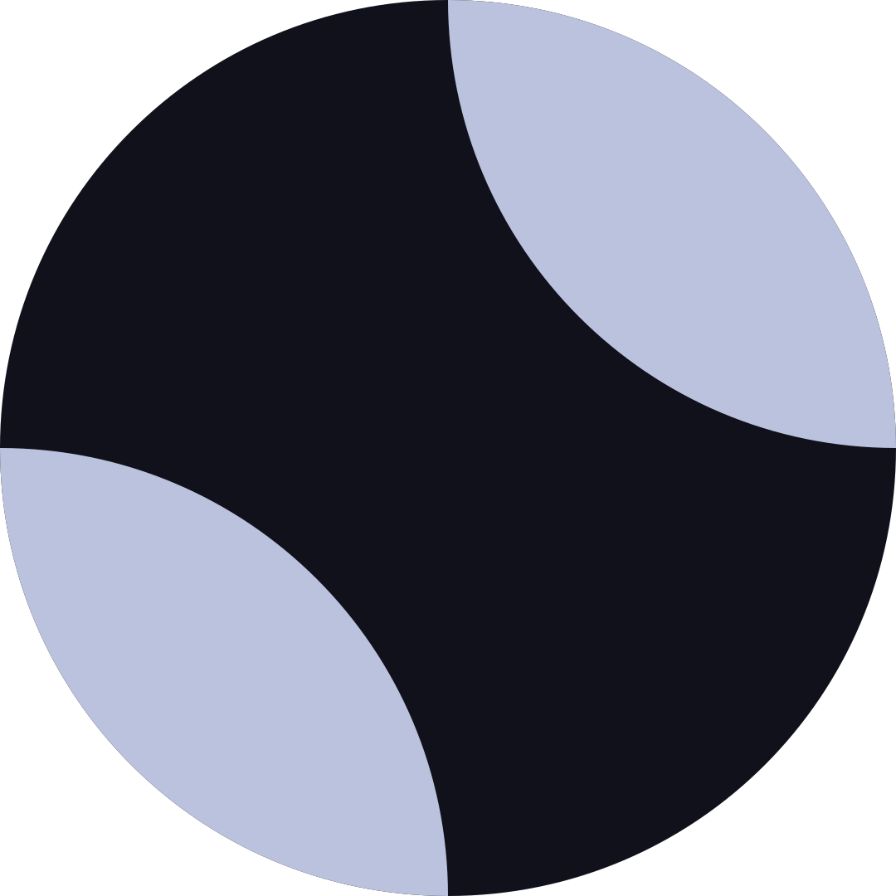
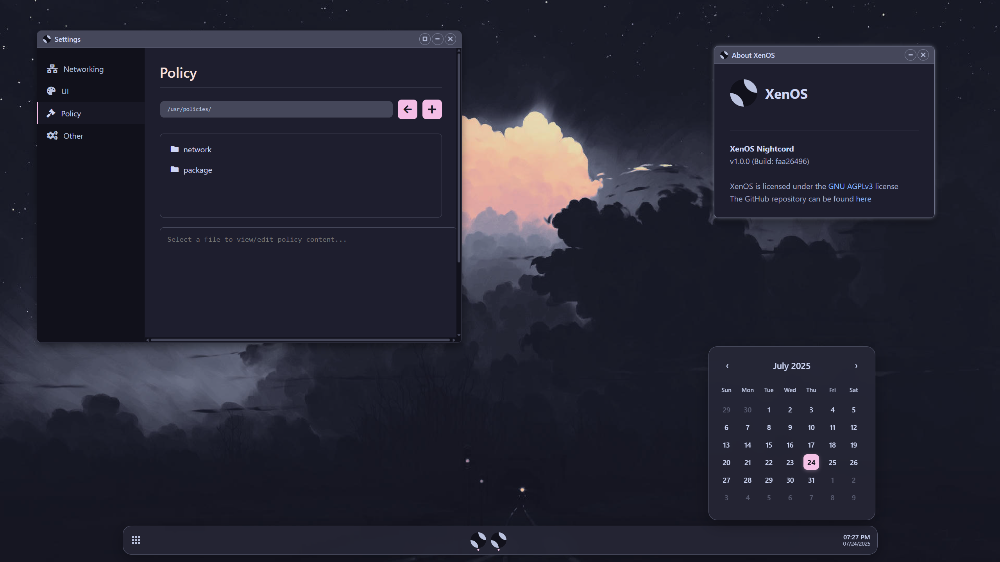
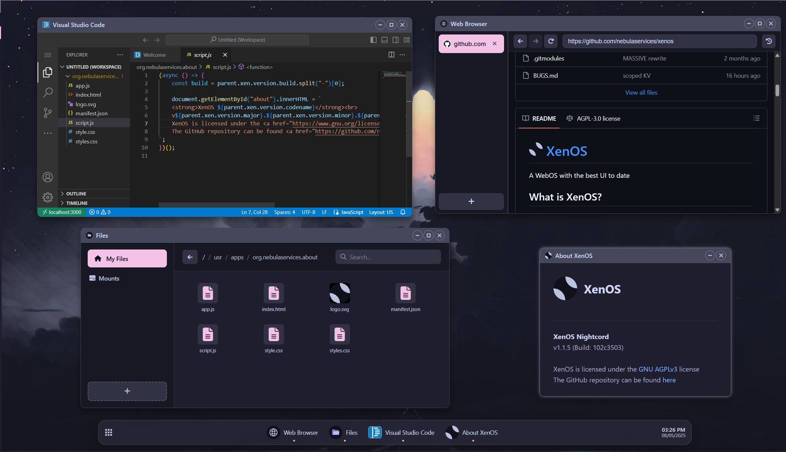

#  [CometOs](https://xen-os.dev)

🚀 A Space-Themed WebOS - Navigate the Digital Cosmos

## What is CometOs?

CometOs is a highly customizable space-themed "WebOS" with a stellar UI and cosmic features. Experience the universe of possibilities as you explore this sleek, astronomy-inspired operating system. Launch your digital journey through the stars!

 |  |
| --- | --- |

## 🌌 Features

- **Space-Themed Interface**: Beautiful cosmic design with nebula backgrounds and stellar aesthetics
- **Highly Customizable**: Personalize your celestial workspace
- **Modern WebOS**: Built with cutting-edge web technologies
- **Sleek UI**: Astronomy-inspired design that's out of this world

## 🛸 Developing CometOs

### Dependencies

- NodeJS
- NPM (PNPM is **strongly** recommended)
- Git
- `uuidgen`

Currently CometOs supports building on Windows, but we cannot promise compatibility forever. We recommended using WSL

### Instructions

First, clone the repo

```sh
$ git clone https://github.com/Apex-dev01/CometOs.git --recursive
$ cd CometOs
```

Install dependencies

```sh
pnpm i # Or npm i
```

To start the dev server

```sh
# If you are on Linux, MacOS, or some other UNIX-like OS:
pnpm dev # or npm run dev

# If you are on Windows, or are just a weirdo who enjoys Powershell
pnpm dev:windows # or npm run dev:windows
```

To build

```sh
# Same spiel as above
pnpm build
pnpm build:windows
```

To serve the build

```sh
pnpm start # or npm start
```

## 📚 Documentation

- Documentation related to APIs can be found at https://docs.xen-os.dev
  - This is an automatically generated TypeDoc build (at `src/`, so it includes ALL the CometOs code), you'll probably want see [this](https://docs.xen-os.dev/modules/xen.html) for a good API overview with JSDoc annotation
- Other documentation can be found [here](./md_docs/README.md)

## 🚧 What's Left?

You can view the project's TODO [here](./TODO.md)

## 🐛 I Found a Bug!!!!

First check [here](./BUGS.md) to see if the bug is already known or check existing GitHub issues, if not, then report it! (Using GitHub issues)

## 📝 Changelog

The changelog can be found [here](./CHANGELOG.md)

## 👥 Contributors

- [Apex-dev01](https://github.com/Apex-dev01) - CometOs space theme and customization
- [Scaratek](https://github.com/scaratech) - Original XenOS developer
- [Madjik](https://github.com/madjikdotpng) - Various UI tweaks and logo designer

Contributions are very much welcome!! Even if it's just fixing my spelling :)

## 🎨 Credit

- Based on [XenOS](https://github.com/Scaratech/XenOS) by Scaratech
- Space theme and cosmic customizations by Apex-dev01
- Color scheme: [Catppuccin](https://catppuccin.com/palette/) (mocha) with space-themed enhancements
- Major inspiration: [AnuraOS](https://anura.pro/)

## 📦 Dependencies Used

- [Bare-Mux](https://github.com/mercuryworkshop/bare-mux)
- [Ultraviolet](https://github.com/titaniumnetwork-dev/ultraviolet)
- [Comlink](https://github.com/GoogleChromeLabs/comlink)
- [JSZip](https://stuk.github.io/jszip/)
- [libcurl.js](https://github.com/ading2210/libcurl.js)
- [wisp-client-js](https://github.com/mercuryworkshop/wisp-client-js)

There are more dependencies used that are not listed here, for a full list, check the [package.json](./package.json)

## 🔧 What Framework Do You Use?!?

None! Just TypeScript and CSS :)

## 📄 Source Code License

CometOs is licensed under the [AGPLv3 License](https://www.gnu.org/licenses/agpl-3.0.en.html)

---

⭐ Star this repo if you love exploring the digital cosmos! 🌠
